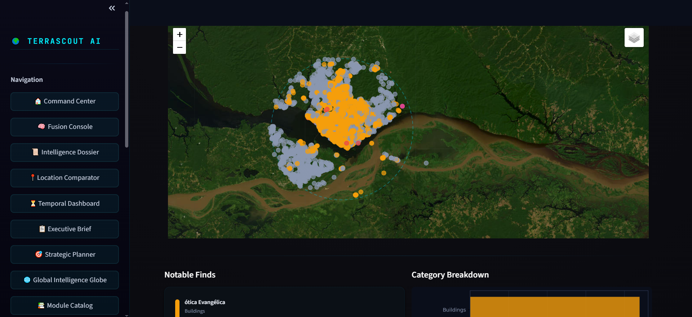
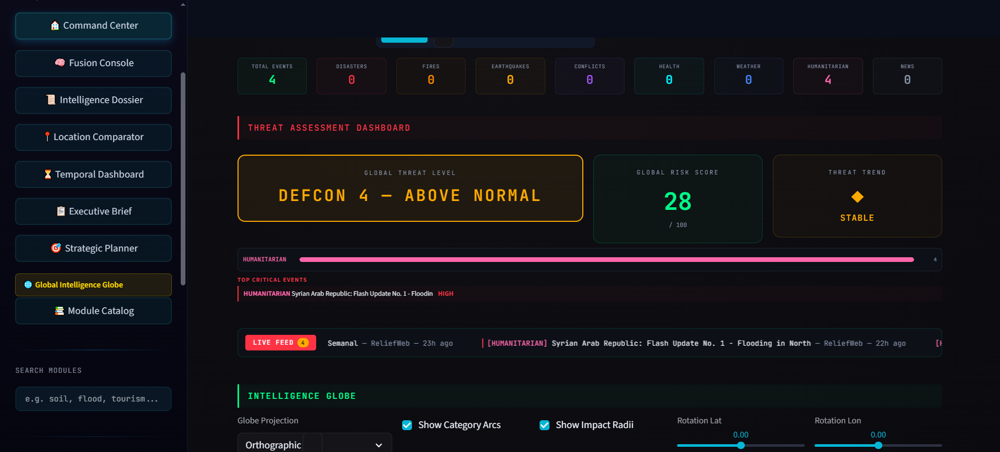

# TerraScout AI

**Open-source geospatial intelligence platform** with **314+ interactive modules**, real-time global monitoring, 60+ free APIs, and AI-powered satellite image analysis.

Built with Streamlit, Folium, Plotly, and Segment Anything Model (SAM/SAM2).

## Screenshots

### Zone Intelligence — Remote Structure Detection

*Satellite view with AI-detected building footprints (Google Open Buildings + Microsoft ML), category breakdown, and notable finds in the Amazon rainforest.*

### Global Intelligence Globe — Threat Assessment Dashboard

*Real-time global threat monitoring with DEFCON level, risk score, live event feed from ReliefWeb, and interactive intelligence globe with orthographic projection.*

---

## Table of Contents

- [Screenshots](#screenshots)
- [Overview](#overview)
- [Features](#features)
- [Installation](#installation)
- [Quick Start](#quick-start)
- [Project Architecture](#project-architecture)
- [Module Categories](#module-categories)
- [Complete Module List](#complete-module-list)
- [External APIs Reference](#external-apis-reference)
- [Remote Structure Detection — APIs & Services Guide](#remote-structure-detection--apis--services-guide)
- [Core Framework Files](#core-framework-files)
- [How to Use Individual Modules](#how-to-use-individual-modules)
- [How to Add a New Module](#how-to-add-a-new-module)
- [Configuration](#configuration)
- [Performance](#performance)
- [Security Notes](#security-notes)
- [Troubleshooting](#troubleshooting)
- [Contributing](#contributing)
- [License](#license)
- [Acknowledgments](#acknowledgments)

---

## Overview

TerraScout AI is a modular geospatial intelligence platform that aggregates 60+ free public APIs into a unified interface. It allows users to:

- **Explore** any location on Earth through 314+ thematic modules
- **Analyze** terrain, climate, biodiversity, soil, risk, and hundreds of other factors
- **Detect** objects in satellite imagery using AI (SAM/SAM2)
- **Monitor** real-time global events (earthquakes, fires, weather, space)
- **Compare** locations side-by-side across dozens of dimensions
- **Export** results as GeoJSON, CSV, PNG for QGIS/ArcGIS

**Key metrics:**
| Metric | Value |
|--------|-------|
| Total Python modules | 382 files |
| Interactive modules | 314+ |
| Module categories | 9 |
| External APIs | 60+ endpoints |
| Thematic map collections | 200+ |
| AI intelligence engines | 40+ |
| Startup time | ~3 seconds (lazy loaded) |
| Authentication required | None (all APIs are free) |

---

## Features

### 1. Thematic Map Modules (200+)

Explore the world through curated, data-rich interactive maps:

| Category | Examples |
|----------|---------|
| **History & Culture** | Ancient civilizations, empires, medieval castles, ruins, UNESCO sites, silk road, trade routes, exploration, pirate maps, treasure maps |
| **Food & Drink** | Coffee, tea, wine, beer, cheese, chocolate, pasta, bread, spice, olive, rice, honey, salt, ice cream, candy, street food |
| **Nature & Geography** | Volcanoes, glaciers, deserts, mountains, islands, caves, fjords, coral reefs, waterfalls, extreme geography, bamboo, gardens |
| **Science & Technology** | Astronomy, genetics, nuclear, space, robotics, technology, telescopes |
| **Arts & Architecture** | Architecture, sculpture, street art, photography, cinema, opera, music, literature, calligraphy, origami, fashion, pottery, glass |
| **Society** | Religion, language, migration, population, economics, education, crime, health, indigenous cultures, martial arts, festivals, dance |
| **Wildlife & Nature** | Animal habitats, biodiversity, dinosaur sites, cryptid sightings, dragon legends, horse traditions |
| **Military & Conflict** | Military bases, fortresses, borders & conflicts, submarine bases, ancient weapons |
| **Curiosities** | Conspiracy theories, paranormal, haunted locations, zodiac, mythology, cryptography |
| **Infrastructure** | Airports, railways, bridges, lighthouses, prisons, skyscrapers, mining, markets, clocks |

Each module features hand-curated datasets with hundreds of geolocated points, rich popups, filterable layers, and educational descriptions.

### 2. AI Intelligence Engines (40+)

Advanced analytical modules that combine multiple data sources:

| Engine | What It Does |
|--------|-------------|
| **Cross-Domain AI** | Pattern detection across 8+ data dimensions |
| **Threat Matrix** | Multi-domain unified threat assessment |
| **Correlation Engine** | Cross-domain data correlation discovery |
| **Decision Matrix** | Multi-criteria decision support |
| **Scenario Simulator** | What-if scenario modeling |
| **Monte Carlo Engine** | Probabilistic risk analysis |
| **Predictive Risk** | Environmental trend forecasting |
| **Geopolitical AI** | Border, resource, and terrain intelligence |
| **Satellite Intelligence** | NDVI, land cover, and vegetation analysis |
| **Unified Intelligence** | Master aggregator of all AI engines |

### 3. Real-Time Global Dashboard

Live monitoring of 23+ data sources aggregated into a single interactive map:

- **Earth Monitoring**: Weather (Open-Meteo), air quality, active wildfires (NASA FIRMS), natural disasters (GDACS), volcanoes, aurora borealis
- **Space & Aviation**: Space weather (NOAA SWPC), ISS tracking, near-Earth asteroids (NASA NeoWs)
- **Financial Markets**: Real-time stock indices, commodities, oil/gold prices (Yahoo Finance)
- **Marine & Ocean**: Vessel tracking, tides (NOAA CO-OPS), ocean data
- **Wind Patterns**: Global wind speed and direction grid (Open-Meteo)

All data is fetched in parallel using `ThreadPoolExecutor` with graceful fallbacks.

### 4. AI Satellite Image Analysis

Powered by **Segment Anything Model (SAM/SAM2)**:

- Draw areas on an interactive map or upload drone/aerial imagery
- Detect and segment objects using text prompts (e.g., "tree", "building", "solar panel")
- Batch processing of multiple areas
- Export results as GeoJSON, CSV, or PNG for use in QGIS/ArcGIS
- Configurable detection thresholds for precision vs. recall

### 5. Remote Structure Explorer

Multi-source search engine for finding structures in remote areas:

- **OpenStreetMap** (Overpass API) — community-mapped structures
- **Google Open Buildings** — 1.8B AI-detected buildings (Africa, Asia, Latin America)
- **Microsoft Building Footprints** — 1B+ ML-detected buildings (global)
- **AI Live Detection** — real-time SAM2 analysis of satellite imagery
- **Global Forest Watch GLAD** — deforestation alerts
- Focus on finding mini-structures (huts, shelters, cabins) under 30 m2

### 6. Satellite Imagery Viewer

Real-time satellite views with tile stitching and download:

- **NASA GIBS**: MODIS True Color, VIIRS True Color, VIIRS False Color (IR), NDVI 8-Day, Thermal Anomalies
- **EOX Sentinel-2 Cloudless**: Annual composites 2018-2024 at 10 m resolution
- **Snapshot Generator**: Stitch tiles into a single downloadable PNG/JPG
- **Date Comparison**: Side-by-side maps of the same location on different dates
- **NDVI Vegetation Profile**: Real-time vegetation health from MODIS satellite data

### 7. Additional Capabilities

- **Location Intelligence**: Unified location selector with search, coordinates, presets, bookmarks
- **Map Catalog**: Browse and search all 314+ modules by category
- **Project Manager**: Save and load analysis sessions with thumbnails
- **Deep Zone Analysis**: Comprehensive area intelligence reports
- **Executive Brief**: AI-generated location intelligence summaries
- **Fusion Console**: 34 analytical sections, 35 algorithms, 40+ data sources in one view
- **GPU Acceleration**: Automatic fallback from GPU to CPU
- **Advanced Caching**: Multi-level caching with configurable TTL
- **Rate Limiting**: Per-API rate limiting and throttling for reliability
- **Async API Client**: Parallel API requests using ThreadPoolExecutor

---

## Installation

### Prerequisites

- **Python 3.10+** (tested with 3.10, 3.11, 3.12, 3.14)
- **pip** (Python package manager)
- **8 GB RAM** minimum (16 GB recommended for AI/SAM features)
- **Windows 10/11**, Linux, or macOS

### Step-by-Step Installation

```bash
# 1. Clone the repository
git clone https://github.com/terrachroniclesvoyager-arch/terrascout-ai.git
cd terrascout-ai

# 2. (Optional) Create a virtual environment
python -m venv venv
# Windows:
venv\Scripts\activate
# Linux/macOS:
source venv/bin/activate

# 3. Install dependencies
pip install -r requirements.txt

# 4. Run the application
streamlit run app.py --server.port 8501
```

### Windows One-Click Launch

Double-click **`start_pocket_gis.bat`** to automatically:
1. Check Python 3.10+ availability
2. Install dependencies (first run only)
3. Set `PROJ_LIB` environment variable (required for pyproj)
4. Launch Streamlit on port 8501
5. Auto-restart on crash with 5-second delay

### Dependencies Summary

| Category | Libraries |
|----------|-----------|
| **Core Framework** | `streamlit >= 1.35.0`, `folium >= 0.18.0`, `streamlit-folium >= 0.22.0` |
| **Data Processing** | `pandas >= 2.2.0`, `geopandas >= 1.0.0`, `numpy >= 2.0.0` |
| **Geospatial** | `rasterio >= 1.4.0`, `shapely >= 2.0.0`, `pyproj >= 3.7.0` |
| **Visualization** | `plotly`, `matplotlib >= 3.9.0`, `pydeck >= 0.9.0`, `branca >= 0.8.0` |
| **Image Processing** | `Pillow >= 11.0.0` |
| **Scientific** | `scipy >= 1.14.0`, `scikit-learn >= 1.4.0` |
| **AI/ML (optional)** | `segment-geospatial >= 0.12.0`, `groundingdino-py >= 0.4.0`, `transformers == 4.46.3` |
| **LiDAR (optional)** | `laspy[lazrs] >= 2.5.0` |
| **Async** | `aiohttp >= 3.9.0` |

> **Note**: AI/ML and LiDAR packages are optional. The app works without them (SAM features will be disabled).

---

## Quick Start

1. Launch the app: `streamlit run app.py`
2. Open browser at `http://localhost:8501`
3. You'll see the **Command Center** — the main dashboard
4. Click **Catalog** to browse all 314+ modules by category
5. Select any module to start exploring
6. Most modules require a **location** — use the location selector (search by name, coordinates, or presets)
7. Results appear as interactive maps, charts, and metrics

### Navigation

- **Command Center**: Main hub with overview and quick-access tiles
- **Catalog**: Browse all modules organized in 9 categories
- **Back buttons**: Every module page has "Command Center" and "Catalog" navigation

---

## Project Architecture

```
terrascout-ai/
├── app.py                          # Main entry point & module router (1400+ lines)
│                                   #   - MODULE_REGISTRY: 9 categories, 314+ modules
│                                   #   - _MODULE_LOOKUP: Flat dict for fast access
│                                   #   - render_module_page(): Routes to lazy-loaded modules
│                                   #   - Inline renderers: map_analysis, image_analysis, etc.
│
├── requirements.txt                # All Python dependencies
├── start_pocket_gis.bat            # Windows launcher with auto-restart
├── LICENSE                         # Open source license
│
├── .streamlit/
│   └── config.toml                 # Streamlit theme (dark) & server config
│
├── src/                            # All 382 Python modules
│   ├── __init__.py
│   │
│   ├── ─── CORE FRAMEWORK ─────────────────────────────────
│   ├── module_loader.py            # Lazy loading system
│   │                               #   - CUSTOM_FUNCTION_NAMES: 187 overrides
│   │                               #   - MODULE_IMPORT_MAP: 638 module paths
│   │                               #   - load_module_render_function()
│   ├── analyzer.py                 # GeoAnalyzer: SAM/SAM2 satellite analysis
│   ├── ui.py                       # Sidebar, map rendering, results display
│   ├── ui_components.py            # Reusable UI components (hero, cards, grids)
│   ├── ui_advanced.py              # Advanced UI widgets
│   ├── project_manager.py          # Save/load analysis projects
│   ├── map_factory.py              # MapFactory: base map creation with presets
│   ├── location_context.py         # Unified location selector & session state
│   ├── app_logger.py               # Structured logging system
│   ├── async_client.py             # Parallel API client (ThreadPoolExecutor)
│   ├── rate_limiter.py             # Per-API rate limiting & throttling
│   ├── overpass_client.py          # OpenStreetMap Overpass API wrapper
│   ├── error_handler.py            # Centralized error handling
│   ├── validators.py               # Input validation utilities
│   ├── export_utils.py             # Data export (GeoJSON, CSV, PNG)
│   ├── advanced_cache_system.py    # Multi-level caching with TTL
│   ├── lazy_data_loader.py         # On-demand data loading
│   │
│   ├── ─── DATA SOURCES ───────────────────────────────────
│   ├── datasources/
│   │   ├── open_buildings.py       # Google Open Buildings (BigQuery + tiles)
│   │   ├── ms_buildings.py         # Microsoft ML Building Footprints
│   │   ├── ai_structure_detector.py # AI-powered structure detection
│   │   ├── biodiversity_apis.py    # GBIF species data
│   │   ├── global_lidar.py         # Global canopy height data
│   │   └── realtime_telemetry.py   # Real-time data streams
│   │
│   ├── ─── EARTH SCIENCE MODULES ──────────────────────────
│   ├── geology.py                  # Macrostrat geological formations
│   ├── elevation.py                # Elevation profiles (OpenTopoData)
│   ├── elevation_profiler.py       # Advanced terrain analysis
│   ├── earthquake.py               # USGS real-time earthquake data
│   ├── ocean_explorer.py           # Wave height, sea conditions
│   ├── soil_explorer.py            # ISRIC SoilGrids soil properties
│   ├── climate_monitor.py          # CO2 levels, temperature anomaly
│   ├── climate_zone.py             # Koppen climate classification
│   ├── climate_forecast.py         # 16-day forecast + historical
│   ├── climate_dashboard.py        # Climate trends & profiles
│   ├── satellite_intelligence.py   # NDVI, land cover analysis
│   ├── satellite_imagery.py        # Satellite views + snapshot generator
│   ├── solar_analysis.py           # Solar irradiance & panel sizing
│   ├── wind_analysis.py            # Wind patterns & energy potential
│   ├── terrain_3d.py               # 3D terrain visualization
│   │
│   ├── ─── AI INTELLIGENCE ENGINES ────────────────────────
│   ├── cross_domain_ai.py          # Multi-domain pattern detection
│   ├── threat_matrix.py            # Unified threat assessment
│   ├── correlation_engine.py       # Cross-domain correlation
│   ├── decision_matrix.py          # Decision support engine
│   ├── geopolitical_ai.py          # Geopolitical intelligence
│   ├── scenario_simulator.py       # What-if scenario modeling
│   ├── predictive_engine.py        # Environmental forecasting
│   ├── unified_intelligence.py     # Master aggregator
│   ├── ai_scoring.py               # Multi-dimensional scoring
│   ├── smart_insights.py           # AI-powered recommendations
│   │
│   ├── ─── ENVIRONMENT & MONITORING ───────────────────────
│   ├── biodiversity.py             # iNaturalist species explorer
│   ├── air_quality.py              # Open-Meteo air quality monitor
│   ├── fire_tracker.py             # NASA FIRMS active fire tracking
│   ├── weather.py                  # Open-Meteo weather & forecasts
│   ├── weather_radar.py            # RainViewer precipitation radar
│   ├── water_explorer.py           # Hydrology features (Overpass)
│   ├── space_tracker.py            # ISS, NEO asteroids, APOD
│   │
│   ├── ─── THEMATIC MAPS (200+ files) ────────────────────
│   ├── agriculture_maps.py         # Crop regions, wine zones
│   ├── archaeology_deep.py         # Ancient sites, pyramids, ruins
│   ├── coffee_maps.py              # Coffee origins & plantations
│   ├── beer_maps.py                # Breweries & beer history
│   ├── ...                         # (200+ thematic map modules)
│   │
│   ├── ─── SPECIALIZED ANALYSIS ───────────────────────────
│   ├── command_center.py           # Main dashboard (GIBS tiles, layers)
│   ├── zone_intelligence.py        # Multi-layer zone analysis
│   ├── deep_zone_analysis.py       # Comprehensive area intelligence
│   ├── fusion_console.py           # 34-section intelligence console
│   ├── executive_brief.py          # AI-generated location summaries
│   ├── intelligence_dossier.py     # Full intelligence dossier
│   ├── construction_ai.py          # Construction feasibility
│   ├── camp_site.py                # Campsite suitability analysis
│   ├── expedition_planner.py       # Expedition planning
│   └── ...                         # (many more specialized modules)
│
├── projects/                       # Saved analysis projects
│   └── (auto-created project directories)
│
├── output/                         # Generated outputs
│   ├── tiles/                      # Downloaded satellite tiles
│   ├── masks/                      # SAM segmentation masks
│   └── uploads/                    # User-uploaded images
│
├── logs/                           # Application logs
│   ├── terrascout_YYYYMMDD.log     # All messages
│   └── errors_YYYYMMDD.log         # Errors only
│
└── tests/
    ├── test_remote_structures_db.py
    └── test_performance.py
```

### How the Module System Works

```
User clicks module in Catalog
        │
        ▼
   app.py: render_module_page(page_id)
        │
        ├── Looks up page_id in _MODULE_LOOKUP (built from MODULE_REGISTRY)
        │
        ├── Gets render_mode = "_lazy_load"
        │
        ▼
   module_loader.py: load_module_render_function(page_id)
        │
        ├── Checks MODULE_IMPORT_MAP → gets "src.module_name"
        │
        ├── Checks CUSTOM_FUNCTION_NAMES → gets "render_xxx_tab"
        │   (or auto-generates: "render_{page_id}_tab")
        │
        ├── importlib.import_module("src.module_name")
        │
        ├── getattr(module, "render_xxx_tab")
        │
        ├── Caches in _render_function_cache
        │
        ▼
   Calls render_xxx_tab() → Streamlit UI appears
```

---

## Module Categories

### 1. Analysis & AI (76 modules) — Color: Cyan

Core analysis engines, AI scoring, suitability analyzers, pattern detection, and intelligence tools.

**Key modules**: Open Buildings AI, Remote Explorer, Zone Intelligence, Deep Zone Analysis, AI Scoring Engine, Smart Insights, Anomaly Detector, Threat Matrix, Pattern Recognizer, Mission Planner, Correlation Engine, Change Detector, Strategic Report, Suitability Analyzer, Multi-Hazard Assessment.

### 2. Earth Science (40 modules) — Color: Violet

Geology, climate, elevation, oceanography, terrain analysis, and disaster monitoring.

**Key modules**: Geology, Elevation, Soil Data, Earthquakes, Ocean & Marine, Extreme Geography, Volcanology, Deserts, Islands, Caves, Waterfalls, Glaciers, Mountains, Fjords, Climate Zone AI, Climate Dashboard, Elevation Profiler, Solar Energy AI, Wind Pattern AI, Satellite Imagery.

### 3. Environment & Life (75 modules) — Color: Emerald

Biodiversity, agriculture, cuisine, nature, botanical, and cultural heritage.

**Key modules**: Biodiversity, Air Quality, Wildfires, NASA Events, Climate Monitor, Weather, Weather Radar, Biogeography, Botanical & Gardens, World Cuisine, Traditional Medicine, Agriculture & Food, Global Biodiversity Heatmap.

### 4. People & Society (58 modules) — Color: Pink

Demographics, culture, festivals, food heritage, martial arts, and social geography.

**Key modules**: Demographics, Global Health, Education, Religion, Language, Migration, Music & Culture, Sports, Festivals, Fashion, Martial Arts, Games, Dance, Indigenous Cultures.

### 5. Infrastructure & Territory (25 modules) — Color: Amber

Roads, transport, energy, urban planning, and built environment.

**Key modules**: OSM Explorer, Land Use, Transport, Urban Analytics, Railway, Airport, Bridge, Energy, Mining, Architecture, Skyscrapers.

### 6. Thematic & Composite Maps (43 modules) — Color: Violet

Historical, civilizations, mythology, literature, and special-interest maps.

**Key modules**: Historical Maps, Civilization Maps, Mythology, Literature, Empires, UNESCO Sites, Trade Routes, Exploration, Writing Systems, Medieval, Calendar Systems.

### 7. Disasters & Risk (22 modules) — Color: Red

Volcanoes, earthquakes, pandemics, climate risk, flood modeling, and emergency response.

**Key modules**: Disaster Maps, Volcanic Activity, Pandemic History, Climate Risk AI, Flood Model, Wildfire Model, Seismic Profiler, Disaster Resilience, Emergency Response, Evacuation Routes.

### 8. Space & Tracking (12 modules) — Color: Indigo

ISS tracking, satellites, maritime, underwater exploration, and space science.

**Key modules**: Space Tracker, Astronomy, Maritime, Shipwreck Maps, Lighthouse Maps, Underwater Maps, Night Vision, Night Ops.

### 9. Real-Time Monitoring (5 modules) — Color: Cyan

Live dashboards and system health.

**Key modules**: Global Real-Time Dashboard, API Health Monitor, Composite Maps.

---

## Complete Module List

<details>
<summary><strong>Click to expand the full list of 314+ modules</strong></summary>

### Analysis & AI
`open_buildings` `remote_explorer` `map_catalog` `zone_intel` `deep_analysis` `compare_locations` `route_analysis` `ai_scoring` `smart_insights` `environmental_dna` `suitability_analyzer` `anomaly_detector` `resource_scanner` `threat_matrix` `pattern_recognizer` `mission_planner` `correlation_engine` `change_detector` `strategic_report` `terrain_classifier` `water_intelligence` `geo_profiler` `site_ranker` `network_analysis` `multi_hazard` `data_fusion` `infra_density` `ecosystem_health` `land_capability` `accessibility_mapper` `climate_risk_ai` `resource_potential` `habitat_analyzer` `soil_intelligence` `microclimate_ai` `environmental_score` `vulnerability_index` `flood_model` `wildfire_model` `seismic_profiler` `land_use_ai` `water_quality_ai` `carbon_footprint` `disaster_resilience` `settlement_ai` `agriculture_ai` `energy_potential` `geo_intelligence` `coastal_analysis` `urban_planning_ai` `emergency_response` `terrain_traversal` `noise_pollution` `biodiversity_hotspot` `logistics_ai` `tourism_potential` `air_quality_ai` `strategic_value` `contamination_ai` `population_density` `mineral_prospecting` `archaeological_ai` `military_terrain` `health_geography` `privacy_index` `survival_score` `real_estate_ai` `forestry_ai` `hydrology_ai` `geopolitical_ai` `renewable_grid` `soil_erosion_ai` `wildlife_corridor` `infrastructure_age` `viewshed_ai` `unified_intelligence` `decision_matrix`

### Earth Science
`geology` `elevation` `soil` `earthquake` `ocean` `extreme_geo` `archaeology_deep` `volcanoes` `deserts` `islands` `caves` `waterfalls` `glaciers` `mountains` `fjords` `waterways` `hidden_structures` `isolated_buildings` `timeline` `terrain_3d` `ocean_proximity` `climate_zone` `climate_dashboard` `ecosystem_health` `land_capability` `climate_forecast` `elevation_profiler` `seasonal_analysis` `soil_health_ai` `wind_analysis` `solar_analysis` `satellite_imagery`

### Environment & Life
`biodiversity` `air_quality` `wildfires` `nasa_events` `climate` `climate_history` `water` `weather` `weather_radar` `biogeography` `botanical` `cuisine` `trad_med` `agriculture` `biodiv_global`

### People & Society
`demographics` `global_health` `education` `religion` `language` `migration` `music_culture` `sports` `fashion` `festival` `pilgrimage` `martial_arts` `games` `dance` `tattoo` `perfume` `toy` `mask` `indigenous`

### Infrastructure & Territory
`osm_explorer` `landuse` `archaeology` `energy` `transport` `urban` `railway` `airport` `bridge` `mining` `lighthouse` `clock` `fortress` `market` `skyscraper`

### Thematic Maps
`thematic` `historical` `civilization` `architecture` `mythology` `empires` `unesco` `exploration` `trade_routes` `literature` `cinema` `opera` `museum` `library` `medieval` `calendar` `writing` `ruins` `myth_locations` `mythology_deep` `calligraphy` `sculpture` `origami` `glass` `pottery` `photography` `zodiac` `coin` `instrument` `street_art` `silk_road` `train_journey` `treasure`

### Disasters & Risk
`disaster` `pandemic` `nuclear` `volcano_deep` `volcano_live` `fire_weather` `evacuation_route` `scenario_simulator` `shelter_analysis` `geological_risk` `pollution_tracker`

### Food & Drink Maps
`coffee` `tea` `wine` `beer` `cheese` `chocolate` `bread` `pasta` `candy` `ice_cream` `honey` `salt` `olive` `spice` `rice` `corn` `wheat` `potato` `soy` `cotton` `street_food` `gastronomy`

### Nature & Wildlife
`animal_maps` `dinosaur` `coral_reef` `bamboo` `garden` `waterpark` `horse` `dragon` `cryptid` `spa`

### Curiosities
`paranormal` `haunted` `conspiracy` `crypto` `pirate` `treasure` `submarine`

### Space & Tracking
`space` `astronomy` `space_tracker` `maritime` `shipwreck` `night_vision` `night_ops` `telescope`

</details>

---

## External APIs Reference

All APIs are **free** and require **no authentication** unless noted. The application works fully without any API keys.

### Weather & Climate

| API | Endpoint | Data | Auth |
|-----|----------|------|------|
| **Open-Meteo Forecast** | `api.open-meteo.com/v1/forecast` | Temperature, precipitation, wind, humidity, UV | Free |
| **Open-Meteo Air Quality** | `air-quality-api.open-meteo.com/v1/air-quality` | AQI, PM2.5, PM10, O3, NO2, SO2, pollen | Free |
| **Open-Meteo Historical** | `archive-api.open-meteo.com/v1/archive` | ERA5 reanalysis historical data | Free |
| **Open-Meteo Climate** | `climate-api.open-meteo.com/v1/climate` | CMIP6 climate projections 2050+ | Free |
| **Open-Meteo Marine** | `marine-api.open-meteo.com/v1/marine` | Waves, sea surface temp, swell | Free |
| **Open-Meteo Flood** | `flood-api.open-meteo.com/v1/flood` | River discharge, flood risk | Free |
| **Open-Meteo Elevation** | `api.open-meteo.com/v1/elevation` | Elevation data | Free |
| **Open-Meteo Geocoding** | `geocoding-api.open-meteo.com/v1/search` | Location search | Free |
| **Global Warming API** | `global-warming.org/api/co2-api` | Historical CO2 concentration | Free |
| **Global Warming API** | `global-warming.org/api/temperature-api` | Global temperature anomaly | Free |
| **RainViewer** | `api.rainviewer.com/public/weather-maps.json` | Precipitation radar tiles | Free |

### Elevation & Terrain

| API | Endpoint | Data | Auth |
|-----|----------|------|------|
| **OpenTopoData SRTM30m** | `api.opentopodata.org/v1/srtm30m` | 30 m elevation (global) | Free |
| **OpenTopoData SRTM90m** | `api.opentopodata.org/v1/srtm90m` | 90 m elevation (global) | Free |
| **OpenTopoData ASTER30m** | `api.opentopodata.org/v1/aster30m` | ASTER 30 m elevation | Free |
| **OpenTopoData ETOPO1** | `api.opentopodata.org/v1/etopo1` | Bathymetry + topography | Free |
| **Open-Elevation** | `api.open-elevation.com/api/v1/lookup` | Elevation lookup | Free |

### Biodiversity & Conservation

| API | Endpoint | Data | Auth |
|-----|----------|------|------|
| **GBIF** | `api.gbif.org/v1/occurrence/search` | Species occurrences (3B+ records) | Free |
| **iNaturalist** | `api.inaturalist.org/v1/observations` | Community science observations | Free |
| **Paleobiology DB** | `paleobiodb.org/data1.2/occs/list.json` | Fossil records | Free |

### Geological & Seismic

| API | Endpoint | Data | Auth |
|-----|----------|------|------|
| **USGS Earthquakes** | `earthquake.usgs.gov/earthquakes/feed/v1.0/summary/` | Real-time earthquakes | Free |
| **USGS Water** | `waterservices.usgs.gov/nwis/iv/` | Streamflow, water levels | Free |
| **Macrostrat** | `macrostrat.org/api/v2/geologic_units/map` | Rock types, geological ages | Free |
| **Smithsonian GVP** | `webservices.volcano.si.edu/geoserver/GVP-VOTW/ows` | Holocene volcanoes | Free |
| **NOAA Tsunami** | `ngdc.noaa.gov/hazel/hazard-service/api/v1/tsunamis/events` | Tsunami history | Free |

### Space & Astronomy

| API | Endpoint | Data | Auth |
|-----|----------|------|------|
| **NASA NEO** | `api.nasa.gov/neo/rest/v1/feed` | Near-Earth asteroids | DEMO_KEY* |
| **NASA APOD** | `api.nasa.gov/planetary/apod` | Astronomy picture of the day | DEMO_KEY* |
| **Open Notify ISS** | `api.open-notify.org/iss-now.json` | Real-time ISS position | Free |
| **Open Notify Astronauts** | `api.open-notify.org/astros.json` | Current astronauts in space | Free |
| **TLE API** | `tle.ivanstanojevic.me/api/tle/` | Satellite orbital data | Free |
| **NOAA Space Weather** | `services.swpc.noaa.gov/products/` | Solar flares, K-index, aurora | Free |

> \* DEMO_KEY allows 30 requests/hour. No registration needed. For higher limits, get a free key at [api.nasa.gov](https://api.nasa.gov).

### Satellite Imagery (Tile Servers)

| Source | URL Pattern | Data | Auth |
|--------|-------------|------|------|
| **NASA GIBS MODIS** | `gibs.earthdata.nasa.gov/wmts/epsg3857/best/MODIS_Terra_CorrectedReflectance_TrueColor/...` | 250 m daily imagery | Free |
| **NASA GIBS VIIRS** | `gibs.earthdata.nasa.gov/wmts/epsg3857/best/VIIRS_SNPP_CorrectedReflectance_TrueColor/...` | 375 m daily imagery | Free |
| **NASA GIBS NDVI** | `map1.vis.earthdata.nasa.gov/wmts-webmerc/MODIS_Terra_NDVI_8Day/...` | 8-day vegetation composite | Free |
| **NASA GIBS Thermal** | `map1.vis.earthdata.nasa.gov/wmts-webmerc/MODIS_Terra_Thermal_Anomalies_Day/...` | Active fires & heat | Free |
| **EOX Sentinel-2** | `tiles.maps.eox.at/wmts/1.0.0/s2cloudless-{year}_3857/...` | 10 m annual composites | Free |
| **ESRI World Imagery** | `server.arcgisonline.com/ArcGIS/rest/services/World_Imagery/MapServer/tile/...` | Satellite basemap | Free |
| **CartoDB Dark** | `basemaps.cartocdn.com/dark_all/...` | Dark basemap tiles | Free |

### Mapping & Geocoding

| API | Endpoint | Data | Auth |
|-----|----------|------|------|
| **Overpass API** | `overpass-api.de/api/interpreter` | OpenStreetMap data queries | Free (3s min interval) |
| **Nominatim** | `nominatim.openstreetmap.org/reverse` | Reverse geocoding | Free (1 req/sec) |
| **REST Countries** | `restcountries.com/v3.1/all` | Country data, borders, flags | Free |
| **Wikipedia** | `en.wikipedia.org/api/rest_v1/page/summary/` | Article summaries | Free |
| **Wikidata SPARQL** | `query.wikidata.org/sparql` | Semantic data queries | Free |

### Environmental & Disasters

| API | Endpoint | Data | Auth |
|-----|----------|------|------|
| **NASA EONET** | `eonet.gsfc.nasa.gov/api/v3/events` | Natural events (fires, floods) | Free |
| **GDACS** | `gdacs.org/gdacsapi/api/events/geteventlist/MAP` | Global disaster alerts | Free |
| **OpenAQ** | `api.openaq.org/v2/latest` | Air quality (190+ countries) | Free |
| **UN ReliefWeb** | `api.reliefweb.int/v1/reports` | Humanitarian crisis reports | Free |
| **NOAA Coral Reef** | `coralreefwatch.noaa.gov/product/vs/data/all_vs_data.json` | Coral bleaching data | Free |
| **NASA FIRMS** | `firms.modaps.eosdis.nasa.gov/api/area/csv` | Active fire detections | DEMO_KEY* |

### Economic & Development

| API | Endpoint | Data | Auth |
|-----|----------|------|------|
| **World Bank** | `api.worldbank.org/v2/country/all/indicator` | GDP, population, development | Free |
| **Yahoo Finance** | via `yfinance` library | Stock indices, commodities | Free |
| **GDELT** | `api.gdeltproject.org/api/v2/geo/geo` | Global news events | Free |

### Building Footprints

| Source | URL | Data | Auth |
|--------|-----|------|------|
| **Google Open Buildings** | `sites.research.google/open-buildings/tiles` | 1.8B AI-detected buildings | Free |
| **Microsoft Buildings** | `minedbuildings.blob.core.windows.net/global-buildings` | 1B+ ML-detected buildings | Free |

### Rate Limits Applied by TerraScout

| API | Min Interval | Max Calls/Min |
|-----|-------------|---------------|
| Open-Meteo | 0.5s | 120 |
| GBIF | 1.0s | 60 |
| USGS Earthquake | 1.0s | 60 |
| Nominatim | 1.0s | 60 |
| iNaturalist | 2.0s | 30 |
| OpenAQ | 2.0s | 30 |
| Overpass API | 3.0s | 20 |
| NASA (DEMO_KEY) | 120s | 0.5 |

---

## Remote Structure Detection — APIs & Services Guide

TerraScout AI combines **4 primary building detection sources** and **5 supporting geospatial APIs** into a unified system for finding structures (buildings, huts, shelters, mining camps) in remote and unmapped areas worldwide. All APIs are **free and require no authentication**.

### Primary Structure Detection Sources

#### 1. Google Open Buildings V3

| Detail | Value |
|--------|-------|
| **What it does** | 1.8 billion buildings detected by AI from satellite imagery |
| **Coverage** | Africa, Asia, Latin America, Caribbean |
| **Access** | BigQuery public dataset or CSV/GeoParquet tiles from Google Cloud Storage |
| **Auth** | None (public dataset) |
| **Key fields** | `area_in_meters`, `confidence` (0–1), `geometry` (WKT polygon), `full_plus_code` |
| **File** | `src/datasources/open_buildings.py` — class `OpenBuildingsClient` |

**How to use**: Search by bounding box (lat/lon), receive polygons with area and ML confidence score. Filter by `area_in_meters` to isolate mini-structures (<30 m²).

#### 2. Microsoft Global ML Building Footprints

| Detail | Value |
|--------|-------|
| **What it does** | 999M+ buildings detected by ML from Bing Maps satellite imagery |
| **Coverage** | Global (100+ countries) |
| **Endpoint** | `https://minedbuildings.blob.core.windows.net/global-buildings` |
| **Auth** | None (public Azure Blob Storage) |
| **Tile system** | Bing Maps quadkey-based tiling (GeoJSON.gz per tile) |
| **File** | `src/datasources/ms_buildings.py` — class `MSBuildingsClient` |

**How to use**: Convert coordinates to Bing quadkey, download compressed GeoJSON tiles, filter by area. Methods: `latlon_to_quadkey()`, `fetch_tile_geojson()`, `search_buildings()`.

#### 3. SAM2 (Segment Anything Model 2) — Real-Time AI Detection

| Detail | Value |
|--------|-------|
| **What it does** | Real-time segmentation of buildings/huts/shelters directly from live satellite imagery |
| **Models** | `sam2-hiera-tiny` (fast) → `sam2-hiera-large` (most accurate) |
| **Imagery source** | Esri World Imagery tiles |
| **Auth** | None (GPU recommended for performance) |
| **Deduplication** | DBSCAN clustering (5.5 m threshold at equator) |
| **File** | `src/datasources/ai_structure_detector.py` — class `AIStructureDetector` |

**Detection prompts and thresholds**:

| Prompt | Threshold |
|--------|-----------|
| `"building"` | 0.20 |
| `"hut, cabin, shack, shed"` | 0.15 |
| `"shelter, refuge, camp"` | 0.18 |
| `"house, dwelling, residence"` | 0.22 |

**How to use**: Provide a bounding box → downloads satellite tiles → runs multi-prompt detection → deduplicates overlapping detections via DBSCAN. Methods: `download_satellite_image()`, `detect_structures_multi_prompt()`, `detect_in_bbox()`.

#### 4. OpenStreetMap (Overpass API)

| Detail | Value |
|--------|-------|
| **What it does** | Community-mapped buildings, ruins, shelters, airstrips, mines, camps |
| **Endpoint** | `https://overpass-api.de/api/interpreter` |
| **Auth** | None |
| **Rate limit** | ~1 req/sec, timeout max 600s |
| **Files** | `src/remote_explorer.py`, `src/isolated_buildings_maps.py`, `src/remote_structures_db.py` |

**Key Overpass QL queries for remote structures**:

```
way["building"](around:radius,lat,lon);          // All buildings
way["ruins"="yes"](around:radius,lat,lon);        // Ruins
node["amenity"="shelter"](around:radius,lat,lon);  // Shelters
way["tourism"="camp_site"](around:radius,lat,lon); // Camps
way["aeroway"~"aerodrome|runway|helipad"](around:radius,lat,lon); // Airstrips
node["man_made"~"mineshaft|adit"](around:radius,lat,lon);         // Mines
way["landuse"="quarry"](around:radius,lat,lon);    // Quarries
way["landuse"="logging"](around:radius,lat,lon);   // Logging areas
way["building"="farm"](around:radius,lat,lon);     // Farms
way["historic"](around:radius,lat,lon);            // Historic sites
```

#### 5. Global Forest Watch (GLAD Alerts)

| Detail | Value |
|--------|-------|
| **What it does** | Satellite-detected deforestation alerts — reveals illegal logging, mining, new settlements |
| **Endpoint** | `https://data-api.globalforestwatch.org/dataset/gfw_integrated_alerts/latest/query` |
| **Coverage** | Tropical and subtropical forests |
| **Auth** | None |
| **Confidence levels** | `high` (3), `nominal` (2), `low` (1) |
| **File** | `src/remote_explorer.py` (lines 250–318) |

**How to use**: Send SQL query with GeoJSON geometry and date filters (90-day rolling window). Returns `latitude`, `longitude`, `date`, `confidence` for each alert.

### Supporting Geospatial APIs

#### 6. ISRIC SoilGrids v2.0

| Detail | Value |
|--------|-------|
| **What it does** | Soil properties (clay, sand, bulk density, organic carbon) — evaluates if terrain can support construction |
| **Endpoint** | `https://rest.isric.org/soilgrids/v2.0/properties/query` |
| **Auth** | None |
| **Files** | `src/construction_ai.py`, `src/settlement_ai.py` |

**How to use**: Point query by lat/lon. Response contains nested `properties.layers[].depths[0].values.mean` — must iterate layers by name (clay, sand, bdod, soc), never access directly.

#### 7. Open Topo Data (SRTM 90m Elevation)

| Detail | Value |
|--------|-------|
| **What it does** | Digital elevation model — slope analysis, terrain accessibility |
| **Endpoint** | `https://api.opentopodata.org/v1/srtm90m` |
| **Auth** | None |
| **Files** | `src/construction_ai.py`, `src/settlement_ai.py` |

**How to use**: Pass pipe-separated coordinates in `locations` parameter. Returns `{"results": [{"elevation": value}]}`.

#### 8. USGS Earthquake Catalog

| Detail | Value |
|--------|-------|
| **What it does** | Seismic hazard assessment — historical earthquakes within 200 km radius |
| **Endpoint** | `https://earthquake.usgs.gov/fdsnws/event/1/query` |
| **Auth** | None |
| **File** | `src/construction_ai.py` |

**How to use**: Query by lat/lon/radius, returns GeoJSON with `magnitude`, `place`, `time` per event.

#### 9. Open-Meteo Weather & Climate

| Detail | Value |
|--------|-------|
| **What it does** | Weather and climate data — evaluates operational conditions for construction/settlement |
| **Endpoint** | `https://api.open-meteo.com/v1/forecast` |
| **Auth** | None |
| **Files** | `src/construction_ai.py`, `src/settlement_ai.py` |

**How to use**: Query by lat/lon, returns daily time series (temperature, precipitation, wind).

### Unified Multi-Source Aggregator

The `src/remote_structures_db.py` file (class `RemoteStructuresDB`) combines all sources into **5 search modes**:

| Mode | Sources | Speed | Best For |
|------|---------|-------|----------|
| `fast` | OSM + Google | Fast | Quick reconnaissance |
| `comprehensive` | OSM + Google + Microsoft | Medium | Full coverage |
| `ai_only` | Google + Microsoft | Medium | Unmapped areas (no OSM data) |
| `ai_live` | SAM2 real-time | Slow (GPU) | Completely unmapped zones |
| `osm_only` | OpenStreetMap only | Fast | Areas with good OSM coverage |

**Deduplication**: DBSCAN clustering (11 m threshold) with source priority: **SAM2 > Google > Microsoft > OSM**.

### Geographic Coverage Summary

| Source | Coverage | Buildings Mapped |
|--------|----------|-----------------|
| Google Open Buildings | Africa, Asia, Latin America | 1.8 billion |
| Microsoft Buildings | Global (100+ countries) | 999M+ |
| OpenStreetMap | Global (community-driven, incomplete) | Variable |
| SAM2 AI | Anywhere (real-time from satellite) | Limited by GPU |
| GFW GLAD Alerts | Tropical/subtropical forests | ~5–10M alerts/year |

### Key Code Files

| File | Purpose | Lines |
|------|---------|-------|
| `src/remote_explorer.py` | Primary remote structure explorer UI | 1036 |
| `src/remote_structures_db.py` | Unified multi-source aggregator | 474 |
| `src/datasources/open_buildings.py` | Google Open Buildings client | 368 |
| `src/datasources/ms_buildings.py` | Microsoft Buildings client | 371 |
| `src/datasources/ai_structure_detector.py` | SAM2 real-time detection | 401 |
| `src/isolated_buildings_maps.py` | Isolation-based structure scanner | 519 |
| `src/hidden_structures_maps.py` | Curated global remote outposts database | 217 |
| `src/settlement_ai.py` | Settlement suitability scoring (8 factors) | 859 |
| `src/construction_ai.py` | Construction feasibility assessment (7 dimensions) | 737 |

---

## Core Framework Files

### `app.py` — Main Application Entry Point

**Purpose**: Routes all navigation, defines MODULE_REGISTRY, manages session state.

**Key structures**:
- `MODULE_REGISTRY` (line ~58): List of 9 category dicts, each containing module definitions
- `_MODULE_LOOKUP` (line ~436): Flat dict `{module_id: module_info}` built from registry
- `render_module_page()` (line ~1035): Routes `page_id` to the correct render function
- Session persistence: auto-saves to `output/last_session.json`

**How to add a module**: Add an entry to the appropriate category in `MODULE_REGISTRY`:
```python
{"id": "your_module", "icon": "🔬", "name": "Your Module Name", "desc": "Short description", "render": "_lazy_load"},
```

---

### `src/module_loader.py` — Dynamic Module Loader

**Purpose**: Lazy-loads modules on demand to keep startup time at ~3 seconds.

**Key structures**:
- `CUSTOM_FUNCTION_NAMES` (line ~17): Dict mapping module IDs to non-standard function names (187 entries)
- `MODULE_IMPORT_MAP` (line ~500): Dict mapping module IDs to import paths (638 entries)
- `_render_function_cache`: In-memory cache of loaded render functions

**Key functions**:
| Function | Purpose |
|----------|---------|
| `load_module_render_function(module_id)` | Load and cache a module's render function |
| `preload_core_modules()` | Pre-load essential modules at startup |
| `get_loaded_modules_count()` | Get count of cached modules |
| `clear_module_cache()` | Clear all cached modules |

**Naming convention**: Standard pattern is `render_{module_id}_tab()`. Override in `CUSTOM_FUNCTION_NAMES` if different.

---

### `src/analyzer.py` — GeoAnalyzer (SAM/SAM2)

**Purpose**: AI-powered satellite image analysis using Segment Anything Model.

**Class: `GeoAnalyzer`**:
| Method | Purpose |
|--------|---------|
| `initialize_model(model_type)` | Load SAM model (mobile_sam, sam1, sam2) |
| `download_image(bbox, zoom)` | Download satellite imagery tiles |
| `set_image(image_path)` | Set custom image for analysis |
| `estimate_tile_count(bbox, zoom)` | Estimate processing tile count |

**Models available**:
| Model | Speed | Precision | GPU Required |
|-------|-------|-----------|-------------|
| mobile_sam | Fast | Good | No |
| sam1 | Balanced | Better | Recommended |
| sam2 | Slow | Best | Yes (gated) |

---

### `src/map_factory.py` — MapFactory

**Purpose**: Creates pre-configured Folium base maps with consistent styling.

**Usage**:
```python
from src.map_factory import MapFactory

m = MapFactory.create_base_map(
    center=(41.89, 12.49),  # Rome
    zoom=10,
    tile_layer="cartodb_dark"  # or "osm", "satellite", "terrain", "topo"
)
```

**Available tile layers**: `osm`, `satellite`, `cartodb_dark`, `terrain`, `topo`

---

### `src/location_context.py` — Location Selector

**Purpose**: Unified location input system used across all modules.

**Key functions**:
| Function | Purpose |
|----------|---------|
| `render_location_selector(key_prefix)` | Render search + coordinates + presets UI |
| `get_location()` | Get current location `{"lat", "lon", "name"}` |
| `has_location()` | Check if a location is set |
| `get_short_name()` | Get location display name |

**Usage in a module**:
```python
from src.location_context import render_location_selector, get_location, has_location

def render_my_module_tab():
    render_location_selector(key_prefix="mymod")
    if not has_location():
        st.info("Select a location above.")
        return
    loc = get_location()
    lat, lon = loc["lat"], loc["lon"]
```

---

### `src/async_client.py` — AsyncAPIClient

**Purpose**: Concurrent API requests using ThreadPoolExecutor.

**Usage**:
```python
from src.async_client import AsyncAPIClient

client = AsyncAPIClient(max_workers=5, timeout=30)

# Single request
result = client.fetch_single("https://api.example.com/data")

# Parallel requests
results = client.fetch_parallel([url1, url2, url3])
# Returns: [{"url": str, "data": dict, "error": str, "status_code": int, "elapsed": float}]
```

---

### `src/rate_limiter.py` — Rate Limiter

**Purpose**: Per-API rate limiting to respect service limits.

**Usage**:
```python
from src.rate_limiter import rate_limiter

# The rate_limiter is a global singleton
rate_limiter.throttle("open-meteo", min_interval=0.5, max_calls_per_minute=120)
```

---

### `src/app_logger.py` — TerraScoutLogger

**Purpose**: Structured, multi-output logging with error categorization.

**Log outputs**:
- Console: WARNING and above
- `logs/terrascout_YYYYMMDD.log`: All messages
- `logs/errors_YYYYMMDD.log`: Errors only

**Usage**:
```python
from src.app_logger import TerraScoutLogger

logger = TerraScoutLogger()
logger.log_api_call("open-meteo", "/forecast", 200, 350)
logger.log_exception(exc, context="loading module X")
```

---

### `src/project_manager.py` — ProjectManager

**Purpose**: File-based project persistence.

**Per-project files**:
- `metadata.json` — Project metadata
- `image.tif` — Satellite image
- `mask.tif` — SAM segmentation mask
- `vectors.geojson` — Detected objects
- `data.csv` — Tabular results
- `thumbnail.png` — Preview image

---

## How to Use Individual Modules

Every module in TerraScout can be used independently. Here's how:

### Using a Module in the App

1. Launch the app: `streamlit run app.py`
2. Go to **Catalog** (sidebar or top navigation)
3. Find the module by category or search
4. Click on it to open the module page
5. Most modules need a **location** — use the location selector
6. Results appear as maps, charts, metrics, and exportable data

### Using a Module's Functions in Your Own Code

Every module is a standalone Python file. You can import and use its functions:

```python
# Example: Get NDVI vegetation data for any location
from src.satellite_intelligence import fetch_ndvi_data

ndvi = fetch_ndvi_data(lat=41.89, lon=12.49)
print(ndvi)
# {'ndvi_current': 0.45, 'ndvi_classification': 'Moderate Vegetation',
#  'vegetation_health': 'Healthy', 'estimated': False,
#  'green_cover_pct': 54.0, 'seasonal_variation': 'HIGH'}
```

```python
# Example: Get elevation for any coordinate
from src.satellite_imagery import _fetch_elevation

elev = _fetch_elevation(lat=45.83, lon=6.86)  # Mont Blanc area
print(elev)
# {'elevation_m': 4808.7, 'source': 'SRTM30m'}
```

```python
# Example: Create a satellite map
from src.map_factory import MapFactory

m = MapFactory.create_base_map(center=(41.89, 12.49), zoom=12, tile_layer="satellite")
m.save("my_map.html")
```

### Module Dependencies

Each module typically imports:
- `streamlit` — for UI (only needed if rendering)
- `requests` — for API calls
- `folium` — for maps
- `plotly` — for charts (optional)
- `src.location_context` — for location selection (optional)
- `src.map_factory` — for base maps (optional)

You can use the data-fetching functions **without Streamlit** — just import them directly.

---

## How to Add a New Module

### Step 1: Create the Module File

Create `src/your_module.py`:

```python
"""
Your Module Name for TerraScout AI.
Brief description of what this module does.
"""

import logging
import requests
import streamlit as st

try:
    import folium
except ImportError:
    folium = None

try:
    from streamlit_folium import st_folium
except ImportError:
    st_folium = None

from src.location_context import render_location_selector, get_location, has_location
from src.map_factory import MapFactory

logger = logging.getLogger(__name__)


@st.cache_data(ttl=900)
def _fetch_data(lat, lon):
    """Fetch data from an API. Cached for 15 minutes."""
    try:
        url = f"https://api.example.com/data?lat={lat}&lon={lon}"
        resp = requests.get(url, timeout=10)
        resp.raise_for_status()
        return resp.json()
    except Exception as exc:
        logger.debug("API call failed: %s", exc)
        return None


def render_your_module_tab():
    """Main render function — called by module_loader."""
    st.markdown("## Your Module Title")
    st.caption("Short description of the module")

    render_location_selector(key_prefix="yourmod")

    if not has_location():
        st.info("Select a location above.")
        return

    loc = get_location()
    lat, lon = loc["lat"], loc["lon"]

    with st.spinner("Loading data..."):
        data = _fetch_data(lat, lon)

    if data:
        st.metric("Result", data.get("value", "N/A"))
    else:
        st.error("Could not fetch data.")
```

### Step 2: Register in `module_loader.py`

Add two entries:

```python
# In CUSTOM_FUNCTION_NAMES (line ~17):
"your_module": "render_your_module_tab",

# In MODULE_IMPORT_MAP (line ~500):
"your_module": "src.your_module",
```

### Step 3: Register in `app.py`

Add to the appropriate category in `MODULE_REGISTRY` (line ~58):

```python
{"id": "your_module", "icon": "🔬", "name": "Your Module", "desc": "What it does", "render": "_lazy_load"},
```

### Step 4: Verify

```bash
# Check syntax
python -c "import ast; ast.parse(open('src/your_module.py').read())"

# Check import
python -c "import src.your_module; print('OK')"

# Run the app and test
streamlit run app.py
```

### Key Rules

- All widget keys must use a **unique prefix** (e.g., `yourmod_`) to avoid conflicts
- Use `@st.cache_data(ttl=...)` for API calls to reduce load
- Use `try/except` guards for optional imports (folium, plotly, etc.)
- Follow the naming pattern: `render_{module_id}_tab()`
- Add to all three places: module file, `CUSTOM_FUNCTION_NAMES`, `MODULE_IMPORT_MAP`, and `MODULE_REGISTRY`

---

## Configuration

### Streamlit Theme (`.streamlit/config.toml`)

```toml
[theme]
base = "dark"
primaryColor = "#06b6d4"
backgroundColor = "#0a0e1a"
secondaryBackgroundColor = "#111827"
textColor = "#e8ecf4"

[server]
port = 8501

[client]
showErrorDetails = true
```

### SAM Models

| Model | ID | Speed | VRAM | Notes |
|-------|----|-------|------|-------|
| Mobile SAM | `mobile_sam` | Fast | 1 GB | Works on CPU, recommended for laptops |
| SAM 1 | `sam1` | Medium | 4 GB | Good balance |
| SAM 2 | `sam2` | Slow | 8 GB | Best precision, requires HuggingFace token |

### Environment Variables (Optional)

| Variable | Purpose | Default |
|----------|---------|---------|
| `NASA_API_KEY` | Higher NASA API rate limits | `DEMO_KEY` (30/hour) |
| `HF_TOKEN` | HuggingFace token for SAM2 gated model | None |
| `FIRMS_MAP_KEY` | NASA FIRMS fire detection | `DEMO_KEY` |
| `PROJ_LIB` | pyproj projection library path | Auto-detected |

> All are optional. The app works fully without any environment variables.

---

## Performance

| Metric | Value |
|--------|-------|
| App startup | ~3 seconds (lazy loading) |
| First module load | ~1 second additional |
| Subsequent loads | Instant (cached) |
| Dashboard data fetch | ~10 seconds (15 parallel workers) |
| Wind patterns | ~9 seconds (30 parallel workers) |
| Satellite snapshot (5x5) | ~5-15 seconds |
| Memory usage | ~200 MB base, ~500 MB with modules |
| SAM analysis | 10-60 seconds (depends on area size) |

### Optimization Techniques Used

- **Lazy loading**: Modules loaded only when accessed
- **Multi-level caching**: `@st.cache_data` with configurable TTL
- **Parallel API calls**: `ThreadPoolExecutor` for concurrent requests
- **Rate limiting**: Automatic throttling to respect API limits
- **Canvas rendering**: `prefer_canvas=True` for Folium maps with many markers

---

## Security Notes

### What's Safe

- **No real API keys** are hardcoded in the code
- All APIs use either no authentication or `DEMO_KEY` (public demo keys)
- `.gitignore` properly excludes `.env` files
- No database credentials, passwords, or private keys in the codebase
- User-entered HuggingFace tokens are handled with `type="password"` masking

### Recommendations for Production

1. Set `showErrorDetails = false` in `.streamlit/config.toml`
2. Use environment variables for any API keys (NASA, FIRMS)
3. Run behind a reverse proxy (nginx) for public deployment
4. Consider adding authentication for multi-user deployments

---

## Troubleshooting

### Common Issues

| Problem | Solution |
|---------|----------|
| `ModuleNotFoundError` | Run `pip install -r requirements.txt` |
| `Unknown module: xyz` | Restart Streamlit completely (Ctrl+C, then relaunch) |
| Slow first launch | Normal — first run installs dependencies |
| Maps not displaying | Install `folium` and `streamlit-folium` |
| SAM not working | Install `segment-geospatial` and `torch` (optional) |
| `PROJ_LIB` error | Set environment variable or use `start_pocket_gis.bat` |
| API rate limited | Wait 1-2 minutes, TerraScout auto-throttles |
| High memory usage | Close unused browser tabs, restart Streamlit |

### Clearing Cache

```bash
# Clear Streamlit cache
streamlit cache clear

# Clear Python bytecode cache
python -c "import shutil, os; [shutil.rmtree(os.path.join(r,d)) for r,dirs,_ in os.walk('.') for d in dirs if d=='__pycache__']"
```

---

## Contributing

Contributions are welcome! Please:

1. Fork the repository
2. Create a feature branch (`git checkout -b feature/new-module`)
3. Follow the [How to Add a New Module](#how-to-add-a-new-module) guide
4. Test your module locally
5. Commit your changes
6. Push to the branch
7. Open a Pull Request

### Code Style

- Use `logging` instead of `print()` for debug output
- Add `@st.cache_data(ttl=...)` to all API calls
- Use `try/except` for optional imports
- Prefix all widget keys with a unique module prefix
- Keep modules self-contained and independently importable

---

## License

This project is open source. See [LICENSE](LICENSE) for details.

---

## Acknowledgments

### Frameworks & Libraries

- [Streamlit](https://streamlit.io/) — Web application framework
- [Folium](https://python-visualization.github.io/folium/) — Interactive maps (Leaflet.js wrapper)
- [Plotly](https://plotly.com/python/) — Interactive charts and visualizations
- [GeoPandas](https://geopandas.org/) — Geospatial data manipulation
- [Segment Anything (SAM)](https://segment-anything.com/) by Meta AI — Image segmentation
- [LangSAM](https://github.com/luca-medeiros/lang-segment-anything) — Text-prompted segmentation

### Data Providers

- [Open-Meteo](https://open-meteo.com/) — Weather, climate, air quality, marine, flood data
- [NASA](https://api.nasa.gov/) — GIBS satellite imagery, EONET events, NEO asteroids, FIRMS fires, APOD
- [USGS](https://earthquake.usgs.gov/) — Earthquake data, water services
- [NOAA](https://www.noaa.gov/) — Space weather, tsunami data, coral reef, tides
- [GBIF](https://www.gbif.org/) — Global Biodiversity Information Facility
- [iNaturalist](https://www.inaturalist.org/) — Community science biodiversity
- [OpenStreetMap](https://www.openstreetmap.org/) — Overpass API, Nominatim geocoding
- [OpenTopoData](https://www.opentopodata.org/) — Elevation data (SRTM, ASTER, ETOPO1)
- [EOX](https://eox.at/) — Sentinel-2 Cloudless imagery
- [Macrostrat](https://macrostrat.org/) — Geological map data
- [GDACS](https://www.gdacs.org/) — Global Disaster Alert and Coordination System
- [World Bank](https://data.worldbank.org/) — Economic and development indicators
- [Google Open Buildings](https://sites.research.google/open-buildings/) — AI-detected building footprints
- [Microsoft Building Footprints](https://github.com/microsoft/GlobalMLBuildingFootprints) — ML building detection
- [REST Countries](https://restcountries.com/) — Country information
- [Smithsonian GVP](https://volcano.si.edu/) — Global Volcanism Program
- [Paleobiology Database](https://paleobiodb.org/) — Fossil occurrence records
- [GDELT Project](https://www.gdeltproject.org/) — Global event database
- [UN ReliefWeb](https://reliefweb.int/) — Humanitarian data
- [OpenAQ](https://openaq.org/) — Open air quality data

---

*Built with data from 60+ free public APIs. No API keys required.*
